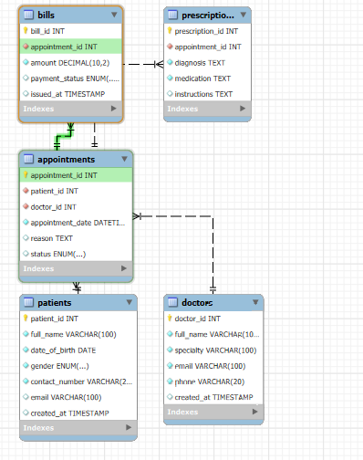

# 🏥 Clinic Booking System

## 📘 Description

The **Clinic Booking System** is a MySQL-based database project that manages clinic operations such as:

- Doctor and patient registration
- Appointment scheduling
- Prescription recording
- Billing and payment tracking

It demonstrates the use of relational database design, with proper normalization and constraints, making it ideal for use in a small to medium-sized clinic.

---

## ⚙️ How to Set Up the Project

Follow these steps to run the project locally using MySQL:

1. Open **MySQL Workbench** (or your preferred SQL client)
2. Create a new schema (e.g., `clinic_db`)
3. Open the `clinic_system.sql` file
4. Execute the SQL script to create all tables with constraints

---

## 📌 Entity Relationship Diagram (ERD)

The ERD below shows the structure and relationships between tables.



---

## 🗃️ Technologies Used

- MySQL (Structured Query Language)
- MySQL Workbench (for ERD and database management)

---

## 📂 Project Structure

```plaintext
clinic-booking-system/
├── clinic_system.sql     # Full SQL script with all table definitions
├── ERD.png               # Screenshot of the ERD diagram
└── README.md             # Project overview and setup guide

